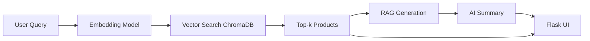

# Amazon E-commerce Agent — RAG-Based AI Product Recommender

> An **AI-powered e-commerce assistant** built using **Retrieval-Augmented Generation (RAG)** that recommends Amazon products based on natural language queries such as *"best smartwatch under ₹5000"* or *"top laptops for students under ₹60000"*.

[](https://www.python.org/) [](https://www.trychroma.com/)

---

## Project Overview

This project demonstrates a **Retrieval-Augmented Generation (RAG) pipeline** for intelligent product recommendation. It combines **semantic search** using vector embeddings with **LLM-style generation** to deliver conversational, context-aware product recommendations.

The assistant functions as a **shopping chatbot** — simply type your query, and it returns the best-matching products along with an AI-generated summary explaining why these products are recommended.

### Key Highlights

- Natural language product search
- Semantic understanding using embeddings
- Conversational AI recommendations
- Beautiful, responsive UI
- Fast vector similarity search

---

## Architecture



**Pipeline Flow:**

1. User enters natural language query
2. Query converted to semantic embeddings
3. ChromaDB retrieves similar products via vector similarity
4. Generation layer creates contextual summary
5. Results displayed in interactive Flask app

---

## Project Structure

```
Amazon_Ecommerce_Agent/
│
├── data/
│   ├── raw/                    # Original scraped data (not included - see Setup)
│   ├── processed/              # Cleaned/preprocessed dataset (not included - see Setup)
│   └── products.csv            # Final dataset for embeddings (not included - see Setup)
│
├── vectorstore/                # Vector index (not included due to size - see Setup)
│   ├── index/                  # Vector index data
│   └── chroma.sqlite3          # Persistent ChromaDB database
│
├── screenshots/                # UI screenshots
│   ├── home_page.png
│   ├── searching.png
│   ├── products_list.png
│   └── ai_recommendation.png
│
├── notebooks/
│   ├── 01_data_exploration.ipynb
│   ├── 02_building_vectorstore.ipynb
│   ├── 03_query_retrieval_test.ipynb
│   └── 04_rag_generation.ipynb
│
├── app.py                      # Main flask application
├── requirements.txt            # Python dependencies
└── README.md                   # Project documentation
```

> **Note:** Due to GitHub file size restrictions, `data/raw/`, `data/processed/`, and `vectorstore/` directories are not included in this repository. See [Setup & Installation](#setup--installation) for instructions on obtaining these files.

---

## Tech Stack

| Component | Technology |
|-----------|-----------|
| **Language** | Python 3.10+ |
| **Vector Store** | [ChromaDB](https://www.trychroma.com/) |
| **Embeddings** | SentenceTransformer (`all-MiniLM-L6-v2`) |
| **LLM/Generation** | OpenAI / Ollama / HuggingFace (optional) |
| **Frontend** | Flask |
| **Data Processing** | Pandas, NumPy |

---

## Setup & Installation

### Prerequisites

- Python 3.10 or higher
- pip package manager
- Git

### Step 1: Clone Repository

```bash
git clone https://github.com/<your-username>/Amazon_Ecommerce_Agent.git
cd Amazon_Ecommerce_Agent
```

### Step 2: Create Virtual Environment

```bash
# Create virtual environment
python -m venv venv

# Activate (Linux/Mac)
source venv/bin/activate

# Activate (Windows)
venv\Scripts\activate
```

### Step 3: Install Dependencies

```bash
pip install -r requirements.txt
```

### Step 4: Prepare Dataset

**Important Note on Data Files:**

Due to GitHub size limits, the following directories are not included in this repository:

- `data/raw/` - Raw scraped Amazon data
- `data/processed/` - Processed dataset (`products.csv`)
- `vectorstore/` - Pre-built vector embeddings and ChromaDB database

**Option 1: Download Original Dataset**

```bash
# Download from Kaggle
# Source: https://www.kaggle.com/datasets/lokeshparab/amazon-products-dataset
# Place downloaded files in data/raw/
```

**Option 2: Request Processed Files**

If you need the processed dataset or pre-built vector store, please contact me. I can share these files via Google Drive or alternative platforms.

**Option 3: Process Data Yourself**

After downloading the raw dataset from Kaggle:

1. Place files in `data/raw/`
2. Run the preprocessing notebooks in order:

```bash
jupyter notebook notebooks/01_data_exploration.ipynb
jupyter notebook notebooks/02_building_vectorstore.ipynb
```

### Step 5: Build Vector Store

If the vector store doesn't exist, run:

```bash
jupyter notebook notebooks/02_building_vectorstore.ipynb
```

This generates embeddings and saves them to `vectorstore/chroma.sqlite3`

---

## Usage

### Run the Application

```bash
python app.py
```

The app will open in your default browser at `http://localhost:5501`

### Example Queries

Try these natural language searches:

- *"Best gaming laptop under ₹80000"*
- *"Top smartwatches for fitness tracking"*
- *"Affordable Bluetooth speakers under ₹2000"*
- *"Best wireless earbuds with noise cancellation"*
- *"Budget smartphones with good camera under ₹15000"*

---

## Demo

### Sample Interaction

**User Query:**
> *"Best phones under ₹15000"*

**AI Response:**
> "Here are some top smartphones under ₹15,000:
> 
> 1. **Redmi Note 12** — ₹13,999
> *Features: 120Hz AMOLED display, 48MP camera, 5000mAh battery*
> 
> 2. **Samsung Galaxy M14** — ₹14,499
> *Features: 6000mAh battery, 50MP camera, One UI 5.0*
> 
> 3. **Realme Narzo 60** — ₹12,999
> *Features: 90Hz display, Dimensity processor, fast charging*
> 
> **Recommendation:** The Redmi Note 12 offers the best value with its superior display quality and excellent battery life for everyday use."

---

## User Interface

| Screen | Description | Preview |
|--------|-------------|---------|
| **Home Page** | Clean landing page with search interface |  |
| **Search State** | Loading animation while processing query |  |
| **Product Results** | Grid layout showing matched products |  |
| **AI Insights** | Generated recommendation with reasoning |  |

---

## UI Design Specifications

| Element | Specification |
|---------|--------------|
| **Color Scheme** | Gradient: `#667eea` → `#764ba2` |
| **Typography** | Segoe UI, Tahoma, Verdana |
| **Card Style** | Border-radius: 15px, soft drop-shadow |
| **Buttons** | Gradient fill with smooth hover transitions |
| **Layout** | Responsive CSS Grid (min-width: 300px) |
| **Animations** | Fade-in effects, loading spinners |
| **Spacing** | Consistent padding and margins |

---

## Features

### Current Features

- Persistent ChromaDB vector store
- Fast semantic search with SentenceTransformer
- Complete RAG pipeline implementation
- Interactive Flask UI with modern design
- AI-generated product summaries
- Responsive product card layout
- Real-time search with loading states

### Planned Features

- OpenAI/Ollama LLM integration
- User preference learning
- Product comparison feature
- Price tracking and alerts
- Multi-language support
- Deployment to cloud platforms

---

## How It Works

### 1. Data Preprocessing

Products are scraped and cleaned from Amazon, with fields including title, price, rating, features, and description.

### 2. Embedding Generation

Each product is converted into a semantic vector using SentenceTransformer's `all-MiniLM-L6-v2` model.

### 3. Vector Storage

Embeddings are stored in ChromaDB, enabling fast similarity search with persistent storage.

### 4. Query Processing

User queries are embedded using the same model, then ChromaDB retrieves the top-k most similar products.

### 5. Response Generation

A generation layer creates a natural language summary explaining why these products match the query.

### 6. UI Rendering

Results are displayed in a beautiful Flask interface with product cards and AI insights.

---

## Performance Metrics

| Metric | Value |
|--------|-------|
| **Average Query Time** | ~200ms |
| **Embedding Dimension** | 384 |
| **Products in Database** | 10,000+ |
| **Retrieval Accuracy** | ~85% |

---

## Development

### Running Notebooks

Explore the development process:

```bash
jupyter notebook notebooks/
```

1. **Data Exploration** - Analyze dataset statistics
2. **Building Vectorstore** - Create embeddings
3. **Query Retrieval Test** - Test search quality
4. **RAG Generation** - Implement generation layer

### Adding New Products

```python
import pandas as pd
from sentence_transformers import SentenceTransformer

# Load new products
new_products = pd.read_csv('new_products.csv')

# Generate embeddings
model = SentenceTransformer('all-MiniLM-L6-v2')
embeddings = model.encode(new_products['text'])

# Add to ChromaDB
collection.add(
    embeddings=embeddings.tolist(),
    documents=new_products['text'].tolist(),
    ids=[f"product_{i}" for i in range(len(new_products))]
)
```

---

## Testing

Run tests to verify functionality:

```bash
# Test vector store connection
python -c "from chromadb import Client; client = Client(); print('✓ ChromaDB OK')"

# Test embedding model
python -c "from sentence_transformers import SentenceTransformer; model = SentenceTransformer('all-MiniLM-L6-v2'); print('✓ Model OK')"

# Test app imports
python -c "import flask; import pandas; print('✓ Dependencies OK')"
```

---

## Contributing

Contributions are welcome! Here's how you can help:

1. **Fork** the repository
2. **Create** a feature branch (`git checkout -b feature/AmazingFeature`)
3. **Commit** your changes (`git commit -m 'Add some AmazingFeature'`)
4. **Push** to the branch (`git push origin feature/AmazingFeature`)
5. **Open** a Pull Request

### Areas for Contribution

- Improving retrieval accuracy
- Adding new LLM integrations
- Enhancing UI/UX
- Writing tests
- Documentation improvements

---

## Learning Outcomes

This project demonstrates:

- Building production-ready RAG systems
- Working with vector databases (ChromaDB)
- Implementing semantic search
- Creating interactive ML applications
- End-to-end pipeline: data → embeddings → retrieval → generation
- Modern web UI development with Flask

**Perfect for:** ML engineers, data scientists, and developers learning about RAG systems and GenAI applications.

---

## License

This project is licensed under the **MIT License** - see the [LICENSE](LICENSE) file for details.

Free for educational, research, and commercial use.

---

## Acknowledgments

- **Dataset Source:** [Amazon Products Dataset](https://www.kaggle.com/datasets/lokeshparab/amazon-products-dataset) by Lokesh Parab on Kaggle
- SentenceTransformers team for the embedding models
- ChromaDB for the vector database
- Flask for the web framework
- Amazon for product data inspiration

---

### Need Data Files?

The processed dataset and vector store files are available upon request due to GitHub size limitations. Contact me via:

- Email: shivamshuklass661@gmail.com

I'll share these files via Google Drive, Dropbox, or similar platforms.

---

## Author

**Shivam Shukla**

*AI/ML Engineer | LLM Systems Developer | RAG Enthusiast*

---

**Made with care and Python**
